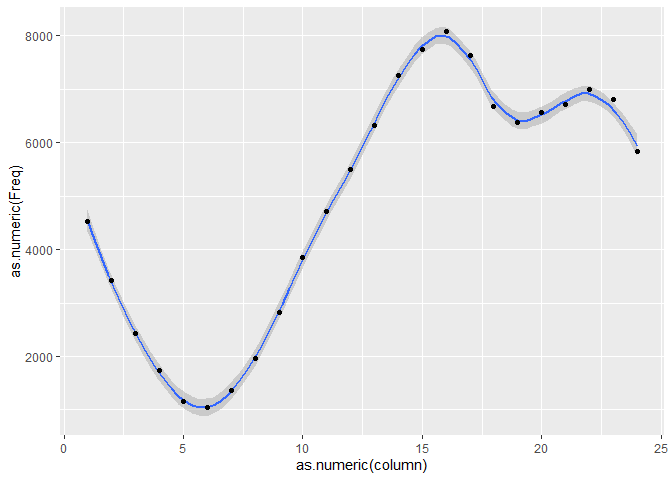

week 2 homework
================
Wouter Bakker
16-2-2020

During this week, I have discovered some methods to extend the music
analysis beyond just Spotify. This has also led me to change my corpus.
Since 2014, I have been keeping track of nearly every song I have
listened to. I did this using a website called Last FM. Music I have
listened to using desktop programs like iTunes and MusicBee are all
included, as well as all my Spotify plays. Recording a play is called
scrobbling, and this way I have “scrobbled” more than 118.000 played
songs since around April 2014, a period of nearly 6 years. Using a
package called “scrobbler” I have imported all my scrobbles to R, and
saved it as a .csv file. The goal is to link all my scrobbles to the
corresponding Spotify data. Luckily, a researcher at the University of
Florida (Andrew Walker, 2019), has done research into patient-directed
music interventions. For this, he linked patient’s Spotify accounts to
Last FM, and with an R script he analysed the data. All the code he used
is published online, and a rundown of his code [can be found
here](https://andrewlouiswalker.com/2019/12/08/music-listening-history-analysis-through-spotify-last-fm-and-genius-apis-for-music-and-delirium-study-in-pediatric-intensive-care-unit/).

Starting out with some preliminary settings. Previously, I have 
converted the date into a proper date format, and extracted for every
song the year, month, day, and hour the song was played. My research
question will be focussed on how my music taste has developed over this
period of time, so these time metrics will come in handy later on.

``` r
rm(list=ls()) #removes variables from workspace
library(ggplot2)
```

    ## Warning: package 'ggplot2' was built under R version 3.6.2

``` r
#Data loading
setwd("C:/Users/Wouter/OneDrive/Psychologie/Jaar 3/Computational Musicology/Last FM")
scrobbles <- read.csv("scrobbles.main.csv")
```

Makes tabs out of artists.

``` r
#Tab of artists, albums and tracks, weekdays, dates etc.
tablate = function(column, FUN) {
  df = as.data.frame(table(column))
  df[order(df[,2], decreasing = FUN),]
  } #function for making tab out of given data, turning it into a dataframe and sorting it by frequency

tab.art = tablate(scrobbles$artist, T)
tab.alb = tablate(scrobbles$album, T)
tab.trc = tablate(scrobbles$song_title, T)
tab.year = tablate(scrobbles$year, F)
tab.month = tablate(scrobbles$month, F)
tab.day = tablate(scrobbles$weekday, F)
tab.hour = tablate(scrobbles$hour, F)
tab.daymonth = tablate(paste(scrobbles$year, scrobbles$month), F)

ggplot(tab.hour, aes(x = as.numeric(column), y = as.numeric(Freq))) + 
  geom_smooth(span = 0.3) + 
  geom_point()
```

    ## `geom_smooth()` using method = 'loess' and formula 'y ~ x'

<!-- -->

This is the first interesting plot. It shows how much music I listen to
during certain times of the day. From this you can see that the pattern
of my music listening reflects my way of living. From evening till night
it dips to its lowest point because I will usually be sleeping. Then it
increases throughout the day (and as you can see, I have never been a
morning person). During dinnertime at 18 it dips slightly, goes up a
little after, and drops for the night again. Now it would be interesting
to see if my habits have changed over the years.

``` r
#First sorts data by date. 
bydate = scrobbles[sort(scrobbles$date, descending = F),]

#Subsets the first and last 10.000 plays
last = bydate[1:10000,]
first = bydate[(nrow(bydate)-10000):nrow(bydate),]
tab.first = tablate(first$hour, F)
tab.last = tablate(last$hour, F)


#Plots the column, containing the hours of the day, against the frequency it occurs. 
#Also adds a smooth regression line
par(mfrow = c(3,1))

ggplot(tab.first, aes(x = as.numeric(column), y = as.numeric(Freq))) +
  geom_smooth(span = 0.3) + 
  geom_point() + 
  labs(title = "Hour of the day for first 10.000 songs", x = "Hour of the day", y = "Songs played")
```

    ## `geom_smooth()` using method = 'loess' and formula 'y ~ x'

<!-- -->

``` r
ggplot(tab.last, aes(x = as.numeric(column), y = as.numeric(Freq))) + 
  geom_smooth(span = 0.3, col = "red") + 
  geom_point() +
  labs(title = "Hour of the day for last 10.000 songs", x = "Hour of the day", y = "Songs played")
```

    ## `geom_smooth()` using method = 'loess' and formula 'y ~ x'

<!-- -->

``` r
ggplot(tab.first, aes(x = as.numeric(column), y = as.numeric(Freq))) +
  geom_smooth(span = 0.3) + 
  labs(title = "Hour of the day for first and last 10.000 songs", x = "Hour of the day", y = "Songs played")+
  geom_smooth(data = tab.last, col = "red", span = 0.3)
```

    ## `geom_smooth()` using method = 'loess' and formula 'y ~ x'
    ## `geom_smooth()` using method = 'loess' and formula 'y ~ x'

<!-- -->

``` r
#Plot of both time periods
```

As you can see, the dip during dinnertime was much more pronounced for
my first 10.000 plays, that occured from 2014-08-11 to 2015-02-14. Back
then, I was still in high school, living with my parents, and we usually
had dinner around 18:00. Of course I also had school every day from
morning till the afternoon, so my life was much more structured. Since
I’ve started studying and moved to Amsterdam, my schedule has become
more unpredictable, and along with it also my music listening habits.

The big challenge if of course to combine the Last FM scrobbles with the
Spotify data. I will try to do so using the research mentioned earlier.
